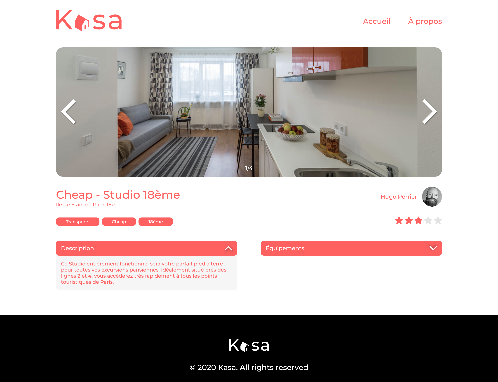
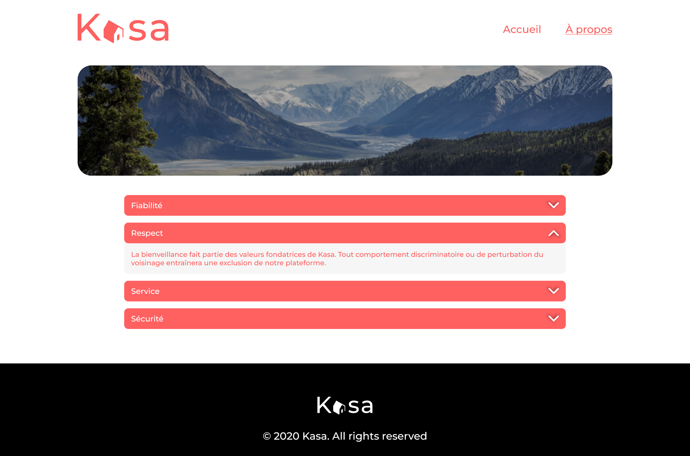

# Kasa

  
  
  

Kasa is the project that introduced us to React and React Router. 
Kasa was a web application developed in ASP.net for booking apartments between individuals. 
To mark its 10th anniversary, we were tasked to redesign the frontend using React.

  

  

  

  

